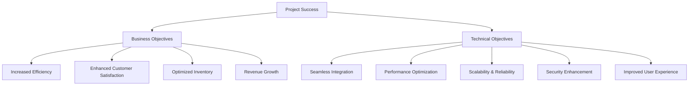
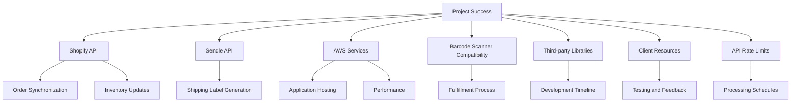
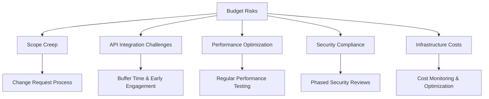
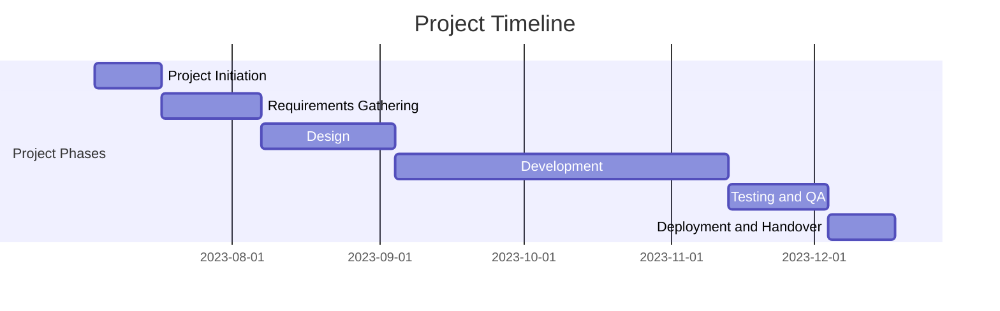
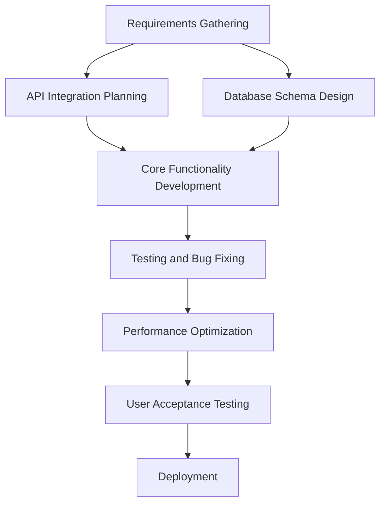
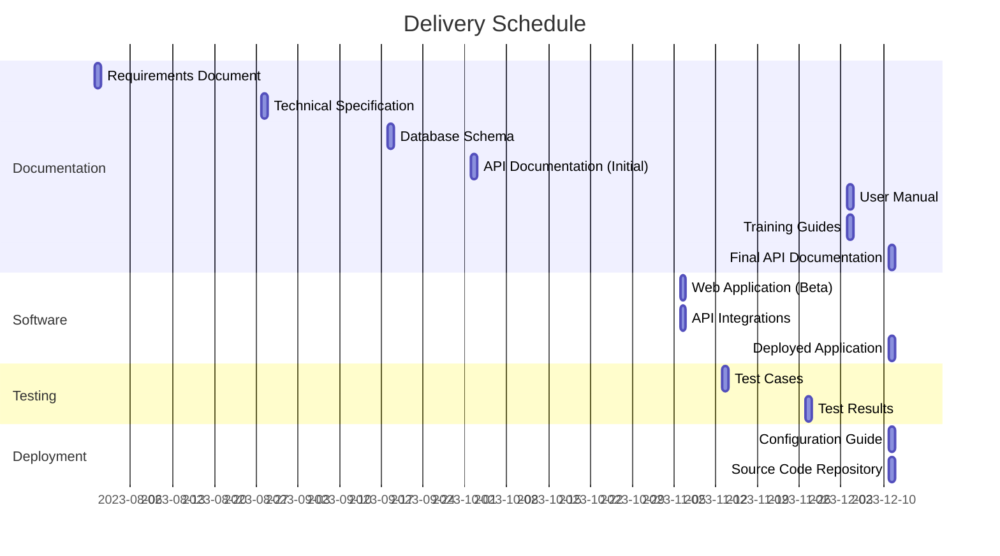

## EXECUTIVE SUMMARY

### PROJECT OVERVIEW

This project aims to develop a comprehensive web-based Inventory Management and Fulfillment Application for an e-commerce store operating on Shopify. The client faces challenges in efficiently managing inventory and streamlining the order fulfillment process. Our proposed solution addresses these issues by creating a seamless integration between the client's Shopify store, inventory management system, and shipping processes.

The application will:
- Automatically pull and categorize unfulfilled orders from Shopify
- Determine order fulfillment feasibility based on real-time inventory levels
- Facilitate order processing through barcode scanning and automated shipping label generation
- Provide robust inventory management tools
- Synchronize data with Shopify to ensure accuracy across platforms

### OBJECTIVES

| Objective | Description | Benefit to Client |
|-----------|-------------|-------------------|
| Streamline Order Management | Automate sorting of unfulfilled orders based on inventory availability | Reduced processing time and improved efficiency |
| Enhance Fulfillment Process | Implement barcode scanning and automated shipping label generation | Minimized errors and faster order processing |
| Improve Inventory Control | Provide tools for easy inventory updates and real-time tracking | Better stock management and reduced stockouts |
| Integrate Systems | Seamlessly connect with Shopify and Sendle APIs | Unified workflow and reduced manual data entry |
| Optimize User Experience | Deliver an intuitive web application interface | Increased productivity and reduced training time |

### VALUE PROPOSITION

Our agency offers a unique combination of expertise and tailored solutions that set us apart for this project:

1. **E-commerce Integration Specialists**: Our team has extensive experience in developing solutions that integrate seamlessly with Shopify and other e-commerce platforms.

2. **Custom-Built Solution**: Unlike off-the-shelf products, our application will be tailored specifically to the client's workflow and requirements, ensuring maximum efficiency and usability.

3. **Scalable Architecture**: We design our solutions with growth in mind, allowing the system to easily accommodate increasing order volumes and inventory complexity.

4. **User-Centric Design**: Our focus on creating intuitive interfaces will minimize the learning curve and maximize adoption among staff.

5. **Ongoing Support and Maintenance**: We offer comprehensive post-launch support to ensure the system continues to meet the client's evolving needs.

6. **Data-Driven Insights**: Our solution will provide valuable analytics and reporting features, enabling the client to make informed decisions about inventory and fulfillment strategies.

By choosing our agency, the client will receive a robust, scalable, and user-friendly solution that not only addresses their current challenges but also positions them for future growth and success in the competitive e-commerce landscape.

## PROJECT OBJECTIVES

### BUSINESS GOALS

1. Increase Operational Efficiency
   - Reduce order processing time by 50%
   - Minimize inventory discrepancies to less than 1%
   - Decrease manual data entry errors by 90%

2. Enhance Customer Satisfaction
   - Improve order fulfillment accuracy to 99.9%
   - Reduce shipping delays by 75%
   - Increase on-time delivery rate to 98%

3. Optimize Inventory Management
   - Reduce stockouts by 80%
   - Decrease excess inventory by 30%
   - Improve inventory turnover ratio by 25%

4. Boost Revenue
   - Increase order fulfillment capacity by 100%
   - Enable faster restocking of popular items
   - Reduce lost sales due to inventory issues by 90%

5. Improve Decision Making
   - Provide real-time visibility into inventory levels and order status
   - Generate actionable insights through data analytics
   - Enable data-driven forecasting for inventory planning

### TECHNICAL GOALS

1. Seamless Integration
   - Fully integrate with Shopify API for real-time order and inventory synchronization
   - Implement Sendle API integration for automated shipping label generation
   - Ensure compatibility with industry-standard barcode scanners

2. Performance Optimization
   - Achieve sub-second response times for inventory queries
   - Handle concurrent processing of up to 1000 orders per hour
   - Implement efficient database indexing for fast data retrieval

3. Scalability and Reliability
   - Design a modular architecture to accommodate future feature additions
   - Implement load balancing to handle traffic spikes
   - Achieve 99.9% uptime for the application

4. Security Enhancement
   - Implement robust user authentication and authorization systems
   - Ensure end-to-end encryption for all data transmissions
   - Comply with industry-standard security protocols and best practices

5. User Experience Improvement
   - Develop an intuitive, responsive web interface
   - Implement real-time updates for inventory and order status changes
   - Create a mobile-friendly design for warehouse staff using tablets or smartphones

### SUCCESS CRITERIA

| Criterion | Target | Measurement Method |
|-----------|--------|---------------------|
| Order Processing Time | 50% reduction | Compare average processing time before and after implementation |
| Inventory Accuracy | 99% | Regular inventory audits and system reconciliation |
| Order Fulfillment Accuracy | 99.9% | Track incorrect shipments and customer complaints |
| System Uptime | 99.9% | Monitoring logs and downtime reports |
| User Adoption Rate | 95% | Track active users and usage patterns |
| API Integration Success | 100% | Verify successful data synchronization between systems |
| Performance Benchmarks | Meet all defined goals | Conduct regular performance testing and monitoring |
| Customer Satisfaction | 20% increase | Conduct surveys and monitor customer feedback |
| ROI | 200% within 18 months | Calculate based on cost savings and increased revenue |

This comprehensive set of objectives and success criteria provides a clear roadmap for the project, aligning business goals with technical implementation and establishing measurable outcomes to gauge the project's success.

## SCOPE OF WORK

### IN-SCOPE

The following tasks, features, and functionalities are included in the project:

1. User Authentication and Authorization
   - Secure login system for authorized personnel
   - Role-based access control (admin, warehouse staff)

2. Dashboard
   - Summary metrics display (unfulfilled orders, fulfillable orders, inventory levels)

3. Order Management
   - Unfulfilled orders listing and sorting
   - Automatic order categorization based on inventory availability
   - Export functionality for unfulfillable orders

4. Order Fulfillment Process
   - Fulfillment modal with barcode scanning functionality
   - Item validation against order details
   - Integration with Sendle API for shipping label generation
   - Shopify order status update via API
   - Inventory adjustment upon successful fulfillment

5. Inventory Management
   - Barcode scanning for inventory intake
   - Manual entry option for inventory updates
   - Bulk addition support for multiple SKUs
   - Inventory listing with filtering and search capabilities

6. Error Handling and Logging
   - User notifications for errors during scanning, fulfillment, or inventory updates
   - System logging for debugging purposes
   - Retry mechanisms for transient errors

7. API Integrations
   - Shopify API integration for order retrieval and updates
   - Sendle API integration for shipping label creation

8. User Interface
   - Responsive web application design optimized for desktop browsers
   - Intuitive navigation and consistent design across all pages

9. Reporting
   - Basic reporting functionality for inventory levels and order fulfillment status

10. Documentation
    - User manuals for the application
    - Technical documentation for future maintenance

### OUT-OF-SCOPE

The following items are explicitly excluded from the project scope:

1. Mobile application development (native iOS or Android apps)
2. Integration with multiple Shopify stores or e-commerce platforms other than Shopify
3. Advanced analytics or business intelligence features
4. Custom hardware procurement or setup (e.g., barcode scanners, label printers)
5. Integration with accounting or ERP systems
6. Automated inventory forecasting or demand planning tools
7. Customer-facing features or portals
8. Multi-language support or localization
9. Advanced warehouse management features (e.g., bin locations, pick routes)
10. Custom shipping carrier integrations beyond Sendle

### ASSUMPTIONS

The project plan is based on the following assumptions:

1. The client has an active Shopify store with API access.
2. The client has or will obtain a Sendle account for shipping label generation.
3. The client will provide timely feedback and approvals during the development process.
4. The client's staff has basic computer literacy and can be trained on the new system.
5. The client has a stable internet connection in their warehouse or fulfillment center.
6. The client will provide sample data for testing purposes, including product information and order history.
7. The client has compatible barcode scanning hardware or is willing to procure it.
8. The project will use cloud-based hosting (AWS EC2) for deployment.
9. The client agrees to use PostgreSQL as the database management system.
10. The client will handle any necessary changes to their internal processes to accommodate the new system.

### DEPENDENCIES

The following dependencies could impact the project timeline or deliverables:

| Dependency | Description | Potential Impact |
|------------|-------------|-------------------|
| Shopify API | Access and stability of Shopify's API | Could affect order synchronization and updates |
| Sendle API | Access and stability of Sendle's API | May impact shipping label generation |
| AWS Services | Availability and performance of EC2 and related services | Could affect application hosting and performance |
| Barcode Scanner Compatibility | Compatibility of client's hardware with the application | May require additional development or hardware procurement |
| Third-party Libraries | Availability and compatibility of required software libraries | Could impact development timeline if alternatives need to be found |
| Client Resources | Availability of client staff for testing and feedback | May affect the timeline for user acceptance testing and final approval |
| API Rate Limits | Shopify and Sendle API rate limits | Could necessitate implementation of queuing systems or adjusted processing schedules |

This diagram illustrates the key dependencies and their potential impacts on various aspects of the project, highlighting the interconnected nature of these factors in achieving project success.

## BUDGET AND COST ESTIMATES

### COST BREAKDOWN

The following table provides a detailed breakdown of the project costs:

| Category | Item | Quantity | Unit Cost | Total Cost |
|----------|------|----------|-----------|------------|
| Labor | Senior Developer | 480 hours | $100/hour | $48,000 |
| Labor | Junior Developer | 640 hours | $60/hour | $38,400 |
| Labor | UI/UX Designer | 160 hours | $80/hour | $12,800 |
| Labor | Project Manager | 240 hours | $90/hour | $21,600 |
| Labor | QA Tester | 160 hours | $70/hour | $11,200 |
| Software | Development Tools & Licenses | 1 | $5,000 | $5,000 |
| Infrastructure | AWS EC2 Instance (1 year) | 1 | $2,000 | $2,000 |
| Infrastructure | AWS RDS PostgreSQL (1 year) | 1 | $1,500 | $1,500 |
| Miscellaneous | Contingency (10%) | 1 | $14,050 | $14,050 |
| **Total** | | | | **$154,550** |

### PAYMENT SCHEDULE

The proposed payment schedule is tied to project milestones and deliverables:

| Milestone | Deliverable | Payment Percentage | Amount |
|-----------|-------------|---------------------|--------|
| Project Kickoff | Signed contract and initial planning documents | 20% | $30,910 |
| Design Approval | Approved UI/UX designs and technical architecture | 15% | $23,182.50 |
| Development Phase 1 | Completed core functionality (user auth, order management) | 20% | $30,910 |
| Development Phase 2 | Completed inventory management and API integrations | 20% | $30,910 |
| User Acceptance Testing | Successful completion of UAT and bug fixes | 15% | $23,182.50 |
| Project Completion | Final deployment and handover of documentation | 10% | $15,455 |

### BUDGET CONSIDERATIONS

Several factors could potentially impact the budget. We have identified these risks and proposed mitigation strategies:

1. **Scope Creep**
   - Risk: Client requests additional features during development.
   - Mitigation: Clearly define project scope in the contract. Use change request process for any additions.

2. **API Integration Challenges**
   - Risk: Unforeseen complexities in Shopify or Sendle API integrations.
   - Mitigation: Allocate additional buffer time for integration. Engage with API support early.

3. **Performance Optimization**
   - Risk: Additional time needed to meet performance requirements.
   - Mitigation: Regular performance testing throughout development. Early identification of bottlenecks.

4. **Security Compliance**
   - Risk: Additional security measures required to meet industry standards.
   - Mitigation: Include security review in each development phase. Budget for potential security enhancements.

5. **Infrastructure Costs**
   - Risk: AWS costs may exceed estimates due to higher than expected usage.
   - Mitigation: Implement AWS cost monitoring. Optimize resource usage regularly.

To manage these risks, we have included a 10% contingency in the budget. Any use of the contingency fund will be communicated to the client with a detailed explanation. If the project is completed under budget, the remaining contingency will not be billed to the client.

We are committed to transparent communication regarding any budget-related issues and will provide regular updates on budget utilization throughout the project lifecycle.

## TIMELINE AND MILESTONES

### PROJECT TIMELINE

The project is estimated to take 24 weeks (approximately 6 months) from initiation to completion. The timeline is divided into the following major phases:

| Phase | Duration | Start Week | End Week |
|-------|----------|------------|----------|
| Project Initiation | 2 weeks | Week 1 | Week 2 |
| Requirements Gathering and Analysis | 3 weeks | Week 3 | Week 5 |
| Design | 4 weeks | Week 6 | Week 9 |
| Development | 10 weeks | Week 10 | Week 19 |
| Testing and Quality Assurance | 3 weeks | Week 20 | Week 22 |
| Deployment and Handover | 2 weeks | Week 23 | Week 24 |

### KEY MILESTONES

The following key milestones mark significant progress points in the project:

1. Project Kickoff (Week 1)
2. Requirements Sign-off (Week 5)
3. Design Approval (Week 9)
4. Development Sprints Completion:
   - Sprint 1: User Authentication and Dashboard (Week 12)
   - Sprint 2: Order Management (Week 14)
   - Sprint 3: Inventory Management (Week 16)
   - Sprint 4: API Integrations (Week 18)
   - Sprint 5: UI/UX Refinement (Week 19)
5. Testing Phase Completion (Week 22)
6. User Acceptance Testing Sign-off (Week 23)
7. Go-Live and Project Handover (Week 24)

### CRITICAL PATH

The following tasks and activities are critical to keeping the project on schedule:

1. Requirements Gathering and Sign-off
   - Delay in finalizing requirements will impact all subsequent phases

2. API Integration Planning
   - Early identification of any potential issues with Shopify and Sendle APIs

3. Database Schema Design
   - Critical for both inventory and order management functionalities

4. Core Functionality Development
   - User Authentication
   - Order Management System
   - Inventory Management System
   - API Integrations (Shopify and Sendle)

5. Testing and Bug Fixing
   - Adequate time for thorough testing and resolving critical issues

6. Performance Optimization
   - Ensuring the application meets performance requirements before deployment

7. User Acceptance Testing (UAT)
   - Client approval is crucial for project success and final deployment

To mitigate risks along the critical path:

1. Regular client communication and feedback sessions will be scheduled throughout the project.
2. Weekly internal team meetings will be held to address any blockers or potential delays.
3. A buffer of 1-2 days is built into each sprint to account for unforeseen challenges.
4. Parallel development tracks will be utilized where possible to optimize the timeline.
5. Early and continuous integration testing will be performed to identify issues promptly.

By closely monitoring these critical path items and maintaining clear communication with all stakeholders, we aim to deliver the project on time and within scope.

## DELIVERABLES

### LIST OF DELIVERABLES

The following table provides a comprehensive list of all tangible outputs that will be delivered as part of this project:

| Category | Deliverable | Description |
|----------|-------------|-------------|
| Software Components | Web Application | Fully functional web-based Inventory Management and Fulfillment Application |
| Software Components | Database | Implemented PostgreSQL database with all necessary tables and relationships |
| Software Components | API Integrations | Completed integrations with Shopify and Sendle APIs |
| Documentation | Requirements Document | Detailed documentation of all system requirements |
| Documentation | Technical Specification | Comprehensive technical documentation of the system architecture and implementation details |
| Documentation | User Manual | Step-by-step guide for end-users on how to use the application |
| Documentation | API Documentation | Detailed documentation of all API endpoints and their usage |
| Documentation | Database Schema | Complete documentation of the database structure and relationships |
| Training Materials | User Training Guide | Training materials for client staff on how to use the new system |
| Training Materials | Admin Training Guide | Specialized training materials for system administrators |
| Deployment | Deployed Application | Fully deployed and operational application on AWS EC2 |
| Deployment | Configuration Guide | Documentation on server setup and configuration |
| Testing | Test Cases | Comprehensive set of test cases covering all system functionalities |
| Testing | Test Results | Detailed report of all test executions and their results |
| Source Code | Version Controlled Repository | All source code delivered via a version control system (e.g., Git) |

### DELIVERY SCHEDULE

The following schedule outlines when each deliverable is expected to be completed and delivered to the client:

| Week | Deliverable |
|------|-------------|
| 5 | Requirements Document |
| 9 | Technical Specification |
| 12 | Database Schema |
| 14 | API Documentation (Initial Version) |
| 19 | Web Application (Beta Version) |
| 19 | API Integrations |
| 20 | Test Cases |
| 22 | Test Results |
| 23 | User Manual |
| 23 | Admin Training Guide |
| 23 | User Training Guide |
| 24 | Deployed Application |
| 24 | Configuration Guide |
| 24 | Final API Documentation |
| 24 | Source Code Repository |

### ACCEPTANCE CRITERIA

The following criteria will be used to determine whether each deliverable meets the client's requirements and can be accepted:

1. Web Application
   - All features specified in the requirements document are implemented and functional
   - Application is responsive and loads within 2 seconds on standard broadband connection
   - Application passes all security tests, including penetration testing
   - User interface is intuitive and follows the approved design specifications
   - Application successfully integrates with Shopify and Sendle APIs

2. Database
   - Database schema matches the approved design
   - All necessary tables and relationships are implemented
   - Database performance meets specified requirements under load testing

3. API Integrations
   - Successful connection and data exchange with Shopify API
   - Successful connection and label generation with Sendle API
   - Error handling and retry mechanisms are in place and functioning

4. Documentation
   - All documents are comprehensive, clear, and free of errors
   - Technical documentation accurately reflects the implemented system
   - User manual covers all features and provides clear instructions

5. Training Materials
   - Materials cover all aspects of system usage for respective user roles
   - Instructions are clear and easy to follow
   - Materials include practical examples and exercises

6. Deployed Application
   - Application is successfully deployed and accessible on AWS EC2
   - Application performs as expected in the production environment
   - All security measures are in place (SSL, firewalls, etc.)

7. Test Cases and Results
   - Test cases cover all system functionalities
   - At least 95% of test cases pass in the final test run
   - Any failed tests have documented resolutions or accepted workarounds

8. Source Code
   - Code follows agreed-upon coding standards and best practices
   - Code is well-commented and maintainable
   - All dependencies are documented and version-controlled

Each deliverable will be reviewed against these criteria. The client will have a 5-business-day review period for each deliverable. Any issues identified during this period will be addressed before the deliverable is considered accepted. Final project acceptance will occur when all individual deliverables have been accepted and the system has been operational in the production environment for a 2-week period without critical issues.