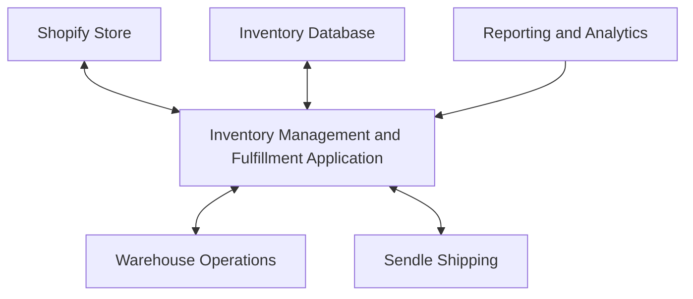
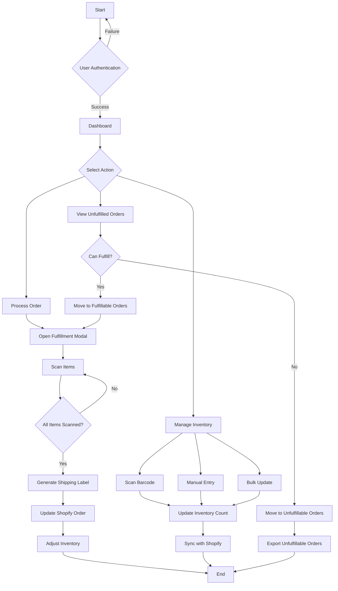
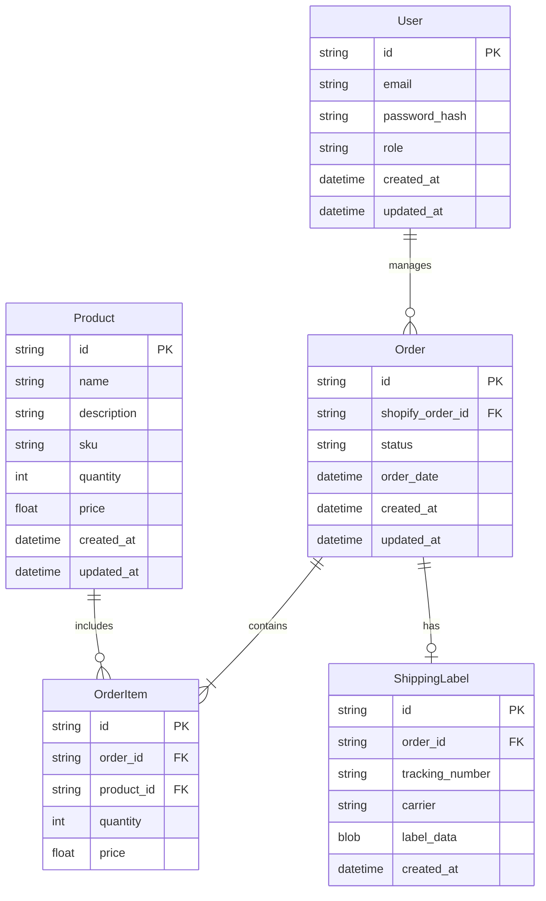
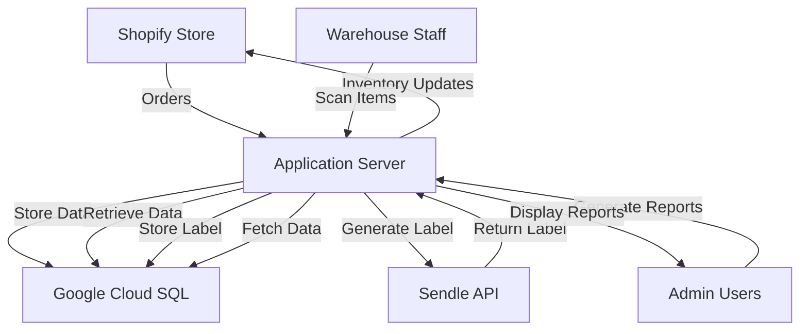

# 1. INTRODUCTION

## 1.1 PURPOSE

The purpose of this Software Requirements Specification (SRS) document is to provide a comprehensive and detailed description of the Inventory Management and Fulfillment Application for an e-commerce store operating on Shopify. This document is intended for:

1. Development Team: To guide the implementation of the software system.
2. Project Managers: To plan and oversee the development process.
3. Quality Assurance Team: To develop test plans and ensure the system meets specified requirements.
4. Client Stakeholders: To review and approve the proposed system functionalities.
5. Maintenance Team: To understand the system architecture for future updates and maintenance.

This SRS aims to clearly define the functional and non-functional requirements, system constraints, and interface specifications to ensure all parties have a shared understanding of the project scope and objectives.

## 1.2 SCOPE

The Inventory Management and Fulfillment Application is a web-based solution designed to streamline and automate the order fulfillment process for e-commerce businesses using Shopify. The system will integrate with Shopify's API to manage orders and inventory, and with Sendle's API for shipping label generation.

### Goals:
1. Automate the process of sorting and fulfilling orders based on inventory availability.
2. Provide real-time inventory management capabilities.
3. Streamline the order fulfillment process through barcode scanning and automated shipping label generation.
4. Improve inventory accuracy and reduce manual errors in the fulfillment process.
5. Enhance overall operational efficiency in order processing and inventory management.

### Benefits:
1. Reduced order processing time and increased fulfillment capacity.
2. Improved inventory accuracy and reduced stockouts.
3. Enhanced customer satisfaction through faster and more accurate order fulfillment.
4. Reduced manual data entry and associated errors.
5. Better visibility into inventory levels and order statuses.

### Core Functionalities:
1. User Authentication and Authorization
   - Secure login system with role-based access control.

2. Order Management
   - Automatic retrieval and categorization of unfulfilled Shopify orders.
   - Sorting orders based on fulfillment capability.

3. Inventory Management
   - Real-time inventory tracking.
   - Barcode scanning for inventory updates.
   - Manual and bulk inventory adjustment options.

4. Order Fulfillment Process
   - Barcode scanning for order item verification.
   - Integration with Sendle API for shipping label generation.
   - Automated Shopify order status updates.

5. Reporting and Analytics
   - Inventory level reports.
   - Order fulfillment performance metrics.

6. API Integrations
   - Shopify API for order and inventory synchronization.
   - Sendle API for shipping label creation.

The application will be developed using TypeScript and React for the frontend, with Tailwind CSS for styling. The backend will be implemented in Python, leveraging the Google Cloud ecosystem for hosting and services where applicable. This modern tech stack ensures a scalable, maintainable, and efficient solution that meets the client's current needs and can adapt to future requirements.

# 2. PRODUCT DESCRIPTION

## 2.1 PRODUCT PERSPECTIVE

The Inventory Management and Fulfillment Application is a web-based solution designed to integrate seamlessly with an existing e-commerce ecosystem. It serves as a critical bridge between the client's Shopify store, inventory management processes, and shipping operations. The application fits into the larger e-commerce environment as follows:

1. Shopify Integration: The application interfaces directly with the client's Shopify store, pulling unfulfilled orders and updating order statuses in real-time.

2. Inventory Control: It acts as the central hub for inventory management, providing real-time tracking and updates that sync with the Shopify store.

3. Shipping Integration: The application connects with Sendle's API to generate shipping labels, streamlining the fulfillment process.

4. Warehouse Operations: It supports on-the-ground warehouse activities through barcode scanning functionality and inventory intake processes.

5. Data Flow: The application serves as a data aggregator, collecting information from various sources (Shopify, inventory scans, shipping labels) and providing a unified interface for management and reporting.

## 2.2 PRODUCT FUNCTIONS

The Inventory Management and Fulfillment Application will perform the following main functions:

1. User Authentication and Authorization
   - Secure login system with role-based access control
   - Management of user roles and permissions

2. Order Management
   - Automatic retrieval of unfulfilled orders from Shopify
   - Categorization of orders based on fulfillment capability
   - Display of order details and status

3. Inventory Management
   - Real-time inventory tracking and updates
   - Barcode scanning for inventory intake and verification
   - Manual and bulk inventory adjustment options
   - Synchronization of inventory levels with Shopify

4. Order Fulfillment Process
   - Guided fulfillment workflow with barcode scanning
   - Integration with Sendle API for shipping label generation
   - Automated updating of order status in Shopify

5. Reporting and Analytics
   - Generation of inventory level reports
   - Order fulfillment performance metrics
   - Export functionality for unfulfillable orders

6. API Integrations
   - Shopify API integration for order and inventory synchronization
   - Sendle API integration for shipping label creation

7. Error Handling and Logging
   - Comprehensive error logging and notification system
   - Retry mechanisms for transient errors, especially in API calls

## 2.3 USER CHARACTERISTICS

The application is designed to cater to various user roles within the e-commerce fulfillment process. The primary user groups and their characteristics are:

1. Warehouse Staff
   - Expertise Level: Basic to intermediate computer skills
   - Responsibilities: Order picking, packing, and shipping
   - Key Needs: Easy-to-use interface, clear instructions for order fulfillment
   - Persona: "Sam the Shipper" - Efficient, detail-oriented, comfortable with barcode scanners

2. Inventory Managers
   - Expertise Level: Intermediate to advanced
   - Responsibilities: Overseeing inventory levels, managing stock
   - Key Needs: Accurate inventory data, ability to make bulk adjustments
   - Persona: "Irene the Inventory Pro" - Analytical, proactive, experienced with inventory systems

3. E-commerce Managers
   - Expertise Level: Advanced
   - Responsibilities: Overseeing entire fulfillment process, analyzing performance
   - Key Needs: Comprehensive reporting, system-wide visibility
   - Persona: "Emma the E-com Expert" - Strategic thinker, data-driven, focused on optimization

4. System Administrators
   - Expertise Level: Expert
   - Responsibilities: Managing user access, system maintenance
   - Key Needs: Advanced configuration options, user management tools
   - Persona: "Alex the Admin" - Technically savvy, security-conscious, problem-solver

## 2.4 CONSTRAINTS

The development and implementation of the Inventory Management and Fulfillment Application are subject to the following constraints:

1. Technical Constraints
   - Must be compatible with modern web browsers (Chrome, Firefox, Safari, Edge)
   - Backend must be developed in Python to align with existing infrastructure
   - Frontend must use TypeScript, React, and Tailwind CSS for consistency and maintainability
   - Must integrate with Shopify and Sendle APIs, adhering to their respective limitations and requirements

2. Regulatory Constraints
   - Must comply with data protection regulations (e.g., GDPR, CCPA) for handling customer information
   - Must adhere to PCI DSS standards for processing and storing any payment-related data

3. Operational Constraints
   - Must be able to handle the client's current order volume with room for 100% growth
   - System downtime for maintenance must not exceed 1 hour per month and must be scheduled during off-peak hours

4. Budgetary Constraints
   - Development and first-year operational costs must not exceed the allocated budget of $154,550
   - Ongoing operational costs (hosting, maintenance) must be optimized for cost-effectiveness

5. Time Constraints
   - The project must be completed within the 24-week timeline as outlined in the project schedule
   - Key milestones must be met to ensure timely delivery and integration with the client's business processes

6. User Interface Constraints
   - The application must be optimized for desktop use in a warehouse environment
   - UI must be intuitive enough to require minimal training for warehouse staff

7. Integration Constraints
   - Must work within the rate limits imposed by Shopify and Sendle APIs
   - Cannot modify the core functionality or data structures of the Shopify store

## 2.5 ASSUMPTIONS AND DEPENDENCIES

The following assumptions and dependencies have been identified for the project:

### Assumptions

1. The client will maintain an active Shopify store and Sendle account throughout the development and operation of the application.
2. The client's warehouse has a stable and sufficiently fast internet connection to support real-time operations.
3. Warehouse staff have basic computer literacy and can be trained to use tablet or desktop computers for the application.
4. The client will provide timely feedback and approvals at key project milestones.
5. The current Shopify store structure and data are consistent and can be reliably used as a basis for integration.
6. The client will handle any necessary changes to their internal processes to accommodate the new system.
7. The volume of orders and inventory will not exceed the projected 100% growth during the initial deployment phase.

### Dependencies

1. Shopify API
   - Availability and stability of Shopify's API
   - Continued support for the API versions used in the application
   - Adherence to Shopify's API rate limits and data structures

2. Sendle API
   - Reliability of Sendle's API for shipping label generation
   - Consistent formatting and data requirements for shipping information

3. Google Cloud Platform
   - Availability and performance of chosen Google Cloud services
   - Compliance with Google Cloud's security and operational standards

4. Hardware Compatibility
   - Compatibility of the client's existing barcode scanners with the application
   - Performance of the application on the client's computer hardware

5. Third-Party Libraries
   - Availability and compatibility of required Python, TypeScript, and React libraries
   - Security and maintenance status of these libraries

6. Data Migration
   - Accuracy and completeness of existing inventory data for initial system setup
   - Successful migration of historical order data, if required

7. User Adoption
   - Effectiveness of user training programs
   - Acceptance of the new system by warehouse staff and management

8. Legal and Compliance
   - Ongoing compliance with relevant data protection and e-commerce regulations
   - Any changes in legal requirements during the project lifecycle

By clearly defining these assumptions and dependencies, the project team can better manage risks and ensure that all stakeholders have a shared understanding of the project's context and potential challenges.

Here's the PROCESS FLOWCHART section for the SRS using Mermaid JS, consistent with the previously mentioned technologies:

## PROCESS FLOWCHART

The following flowchart illustrates the main processes of the Inventory Management and Fulfillment Application:

This flowchart outlines the main processes of the application, including:

1. User Authentication
2. Dashboard and Action Selection
3. Order Management
   - Viewing unfulfilled orders
   - Categorizing orders as fulfillable or unfulfillable
4. Inventory Management
   - Barcode scanning
   - Manual entry
   - Bulk updates
5. Order Fulfillment Process
   - Item scanning
   - Shipping label generation
   - Shopify order update
   - Inventory adjustment
6. Data Synchronization with Shopify

The application will be developed using TypeScript and React for the frontend, with Tailwind CSS for styling. The backend will be implemented in Python, ensuring consistency with the previously mentioned technology stack. This architecture allows for a responsive and intuitive user interface while providing a robust and scalable backend to handle complex inventory and order management processes.

Here's a breakdown of the product features with the requested sub-sections, using TypeScript, React, and Tailwind CSS for UIs, Python for backends, and Google Cloud ecosystem solutions where applicable:

1. User Authentication and Authorization

ID: F001
DESCRIPTION: Secure login system with role-based access control for authorized personnel.
PRIORITY: High

| Functional Requirement | Description |
|------------------------|-------------|
| F001-1 | Implement secure login using JWT tokens |
| F001-2 | Create user roles (admin, warehouse staff) |
| F001-3 | Implement role-based access control for different features |
| F001-4 | Integrate with Google Cloud Identity Platform for authentication |

2. Dashboard

ID: F002
DESCRIPTION: Display summary metrics such as total unfulfilled orders, orders that can/cannot be fulfilled, and current inventory levels.
PRIORITY: Medium

| Functional Requirement | Description |
|------------------------|-------------|
| F002-1 | Create a responsive dashboard using React and Tailwind CSS |
| F002-2 | Display key metrics in real-time |
| F002-3 | Implement data visualization using charts and graphs |
| F002-4 | Allow customization of dashboard widgets |

3. Order Management

ID: F003
DESCRIPTION: Manage unfulfilled orders, categorize them based on fulfillment capability, and provide export functionality for unfulfillable orders.
PRIORITY: High

| Functional Requirement | Description |
|------------------------|-------------|
| F003-1 | Retrieve and display unfulfilled orders from Shopify API |
| F003-2 | Implement order sorting and filtering functionality |
| F003-3 | Categorize orders as fulfillable or unfulfillable based on inventory |
| F003-4 | Provide CSV export for unfulfillable orders |

4. Order Fulfillment Process

ID: F004
DESCRIPTION: Implement a fulfillment workflow with barcode scanning, item validation, shipping label generation, and inventory adjustment.
PRIORITY: High

| Functional Requirement | Description |
|------------------------|-------------|
| F004-1 | Create a fulfillment modal with barcode scanning functionality |
| F004-2 | Implement item validation against order details |
| F004-3 | Integrate with Sendle API for shipping label generation |
| F004-4 | Update Shopify order status via API |
| F004-5 | Adjust inventory levels upon successful fulfillment |

5. Inventory Management

ID: F005
DESCRIPTION: Provide tools for inventory intake, updates, and overview with filtering and search capabilities.
PRIORITY: High

| Functional Requirement | Description |
|------------------------|-------------|
| F005-1 | Implement barcode scanning for inventory intake |
| F005-2 | Create manual entry forms for inventory updates |
| F005-3 | Develop bulk update functionality for multiple SKUs |
| F005-4 | Implement inventory listing with filtering and search |
| F005-5 | Sync inventory data with Shopify in real-time |

6. API Integrations

ID: F006
DESCRIPTION: Integrate with Shopify and Sendle APIs for order management, inventory synchronization, and shipping label generation.
PRIORITY: High

| Functional Requirement | Description |
|------------------------|-------------|
| F006-1 | Implement Shopify API integration for order retrieval and updates |
| F006-2 | Develop Sendle API integration for shipping label creation |
| F006-3 | Implement error handling and retry mechanisms for API calls |
| F006-4 | Create a background job system for API synchronization using Google Cloud Tasks |

7. Reporting and Analytics

ID: F007
DESCRIPTION: Generate reports on inventory levels, order fulfillment status, and performance metrics.
PRIORITY: Medium

| Functional Requirement | Description |
|------------------------|-------------|
| F007-1 | Create inventory level reports with historical data |
| F007-2 | Implement order fulfillment performance metrics |
| F007-3 | Develop custom report generation functionality |
| F007-4 | Integrate with Google Cloud BigQuery for data warehousing and analysis |

8. Error Handling and Logging

ID: F008
DESCRIPTION: Implement comprehensive error handling, user notifications, and system logging for debugging purposes.
PRIORITY: Medium

| Functional Requirement | Description |
|------------------------|-------------|
| F008-1 | Implement user-friendly error messages for common issues |
| F008-2 | Create a centralized logging system using Google Cloud Logging |
| F008-3 | Implement error tracking and alerting for critical issues |
| F008-4 | Develop an admin interface for log viewing and analysis |

9. User Interface

ID: F009
DESCRIPTION: Design and implement an intuitive, responsive web application optimized for desktop browsers.
PRIORITY: High

| Functional Requirement | Description |
|------------------------|-------------|
| F009-1 | Develop a responsive UI using React and Tailwind CSS |
| F009-2 | Implement consistent design patterns across all pages |
| F009-3 | Create an intuitive navigation system |
| F009-4 | Optimize UI performance for desktop browsers |

10. System Administration

ID: F010
DESCRIPTION: Provide tools for system configuration, user management, and monitoring.
PRIORITY: Low

| Functional Requirement | Description |
|------------------------|-------------|
| F010-1 | Develop an admin panel for user management |
| F010-2 | Implement system configuration options |
| F010-3 | Create monitoring dashboards for system health and performance |
| F010-4 | Integrate with Google Cloud Monitoring for system-wide metrics |

This feature breakdown maintains consistency with the previously mentioned technologies and incorporates Google Cloud solutions where applicable. The backend will be implemented in Python, while the frontend uses TypeScript, React, and Tailwind CSS. Google Cloud services are utilized for authentication, task management, logging, and monitoring to leverage the Google Cloud ecosystem.

# 5. NON-FUNCTIONAL REQUIREMENTS

## 5.1 PERFORMANCE

| ID | Requirement | Description |
|----|-------------|-------------|
| NFR-P1 | Response Time | The application shall respond to user interactions within 500ms under normal load conditions. |
| NFR-P2 | Page Load Time | Initial page load time shall not exceed 2 seconds on a standard broadband connection. |
| NFR-P3 | API Response Time | API calls to Shopify and Sendle shall complete within 3 seconds, with appropriate error handling for longer durations. |
| NFR-P4 | Concurrent Users | The system shall support at least 50 concurrent users without degradation in performance. |
| NFR-P5 | Order Processing | The system shall be capable of processing up to 1000 orders per hour during peak times. |
| NFR-P6 | Database Queries | 95% of database queries shall complete in less than 100ms. |
| NFR-P7 | Resource Usage | The application shall not consume more than 2GB of RAM on the client-side. |

## 5.2 SAFETY

| ID | Requirement | Description |
|----|-------------|-------------|
| NFR-S1 | Data Backup | The system shall perform daily backups of all data, stored securely in Google Cloud Storage. |
| NFR-S2 | Disaster Recovery | A disaster recovery plan shall be in place with a Recovery Time Objective (RTO) of 4 hours and a Recovery Point Objective (RPO) of 1 hour. |
| NFR-S3 | Failover | The system shall implement automatic failover to a secondary server in case of primary server failure. |
| NFR-S4 | Data Integrity | The system shall maintain ACID (Atomicity, Consistency, Isolation, Durability) properties for all database transactions. |
| NFR-S5 | Error Handling | The application shall gracefully handle and log all errors without exposing sensitive information to users. |

## 5.3 SECURITY

| ID | Requirement | Description |
|----|-------------|-------------|
| NFR-SEC1 | Authentication | The system shall use Google Cloud Identity Platform for user authentication, supporting multi-factor authentication. |
| NFR-SEC2 | Authorization | Role-based access control (RBAC) shall be implemented to restrict access to features based on user roles. |
| NFR-SEC3 | Data Encryption | All data at rest shall be encrypted using AES-256 encryption. |
| NFR-SEC4 | Data in Transit | All data in transit shall be encrypted using TLS 1.3 or higher. |
| NFR-SEC5 | API Security | API endpoints shall be secured using OAuth 2.0 for authentication and rate limiting to prevent abuse. |
| NFR-SEC6 | Password Policy | The system shall enforce a strong password policy (minimum 12 characters, including uppercase, lowercase, numbers, and special characters). |
| NFR-SEC7 | Session Management | User sessions shall expire after 30 minutes of inactivity. |
| NFR-SEC8 | Audit Logging | The system shall maintain detailed audit logs of all user actions and system events. |

## 5.4 QUALITY

### 5.4.1 Availability

| ID | Requirement | Description |
|----|-------------|-------------|
| NFR-Q1 | Uptime | The system shall maintain 99.9% uptime, excluding scheduled maintenance windows. |
| NFR-Q2 | Scheduled Maintenance | Scheduled maintenance shall not exceed 4 hours per month and must be performed during off-peak hours. |

### 5.4.2 Maintainability

| ID | Requirement | Description |
|----|-------------|-------------|
| NFR-Q3 | Code Standards | All code shall adhere to agreed-upon coding standards for TypeScript, React, Python, and SQL. |
| NFR-Q4 | Documentation | Comprehensive documentation shall be maintained for all system components, APIs, and databases. |
| NFR-Q5 | Version Control | All source code shall be version-controlled using Git, with a clear branching and merging strategy. |

### 5.4.3 Usability

| ID | Requirement | Description |
|----|-------------|-------------|
| NFR-Q6 | Intuitive Design | The user interface shall follow Material Design principles for consistency and intuitiveness. |
| NFR-Q7 | Accessibility | The application shall comply with WCAG 2.1 Level AA standards for accessibility. |
| NFR-Q8 | Responsiveness | The UI shall be responsive and functional on desktop browsers with a minimum resolution of 1024x768. |

### 5.4.4 Scalability

| ID | Requirement | Description |
|----|-------------|-------------|
| NFR-Q9 | Horizontal Scaling | The application shall be designed to scale horizontally to handle increased load. |
| NFR-Q10 | Database Scaling | The database shall be capable of scaling to handle up to 10 million SKUs and 1 million orders. |

### 5.4.5 Reliability

| ID | Requirement | Description |
|----|-------------|-------------|
| NFR-Q11 | Error Rate | The system shall have an error rate of less than 0.1% for all transactions. |
| NFR-Q12 | Data Consistency | The system shall ensure data consistency across all components with a maximum lag of 5 seconds. |

## 5.5 COMPLIANCE

| ID | Requirement | Description |
|----|-------------|-------------|
| NFR-C1 | Data Protection | The system shall comply with GDPR and CCPA requirements for data protection and privacy. |
| NFR-C2 | PCI DSS | The application shall be PCI DSS compliant for handling payment card information. |
| NFR-C3 | API Compliance | All API integrations shall comply with the respective API provider's terms of service and usage policies. |
| NFR-C4 | Accessibility Standards | The application shall comply with Section 508 of the Rehabilitation Act for accessibility. |
| NFR-C5 | Data Retention | The system shall implement data retention policies in compliance with relevant regulations. |
| NFR-C6 | Audit Trail | The system shall maintain an immutable audit trail of all data modifications for compliance and forensic purposes. |

These non-functional requirements are designed to ensure that the Inventory Management and Fulfillment Application is performant, secure, reliable, and compliant with relevant standards and regulations. The use of TypeScript, React, and Tailwind CSS for the frontend, Python for the backend, and Google Cloud solutions for infrastructure aligns with the previously established technology stack and provides a robust foundation for meeting these requirements.

# 6. DATA REQUIREMENTS

## 6.1 DATA MODELS

The Inventory Management and Fulfillment Application will use the following data models:

## 6.2 DATA STORAGE

The application will use Google Cloud SQL for PostgreSQL as the primary database solution, ensuring scalability, reliability, and compatibility with our Python backend.

### 6.2.1 Data Retention

- Order data will be retained for 7 years to comply with financial regulations.
- User data will be retained for the duration of the account's active status plus 30 days after account deletion.
- Product data will be retained indefinitely, with historical versions maintained for auditing purposes.

### 6.2.2 Redundancy and Backup

- Google Cloud SQL will be configured for high availability with automatic failover.
- Daily automated backups will be performed and retained for 30 days.
- Point-in-time recovery will be enabled, allowing data restoration to any point within the last 7 days.

### 6.2.3 Recovery

- A disaster recovery plan will be implemented with a Recovery Time Objective (RTO) of 4 hours and a Recovery Point Objective (RPO) of 1 hour.
- Regular disaster recovery drills will be conducted to ensure the effectiveness of the recovery process.

### 6.2.4 Scalability

- Google Cloud SQL instances will be configured to automatically scale vertically based on CPU and memory usage.
- Read replicas will be implemented to handle increased read traffic as the application scales.

## 6.3 DATA PROCESSING

### 6.3.1 Data Security

- All data at rest will be encrypted using Google Cloud SQL's built-in encryption.
- Data in transit will be encrypted using TLS 1.3.
- Access to the database will be restricted to the application servers and authorized personnel only, using Google Cloud IAM.
- Sensitive data such as user passwords will be hashed using bcrypt before storage.
- Regular security audits and penetration testing will be conducted to ensure data protection.

### 6.3.2 Data Flow

The following diagram illustrates the high-level data flow within the application:

### 6.3.3 Data Processing Workflows

1. Order Processing:
   - New orders are fetched from Shopify API periodically.
   - Orders are stored in the database and checked against inventory.
   - Fulfillable orders are queued for processing.
   - Unfulfillable orders are flagged for review.

2. Inventory Management:
   - Inventory levels are updated in real-time as orders are processed.
   - Barcode scans trigger inventory adjustments.
   - Bulk updates are processed asynchronously to avoid system overload.
   - Inventory changes are synced back to Shopify.

3. Shipping Label Generation:
   - When an order is ready for fulfillment, shipping details are sent to Sendle API.
   - Generated labels are stored in the database and associated with the order.
   - Tracking information is updated in Shopify.

4. Reporting and Analytics:
   - Aggregated data is processed nightly and stored in separate analytics tables.
   - Real-time reports use caching mechanisms to reduce database load.
   - Large report generations are processed as background jobs.

By implementing these data requirements, the Inventory Management and Fulfillment Application will ensure secure, efficient, and scalable data handling, consistent with the use of Python for the backend and Google Cloud ecosystem solutions.

# 3. EXTERNAL INTERFACES

## 3.1 USER INTERFACES

The Inventory Management and Fulfillment Application will feature a web-based user interface designed for desktop browsers, optimized for use in a warehouse environment. The UI will be developed using React for component structure and Tailwind CSS for styling, ensuring a responsive and intuitive design.

Key UI components include:

1. Login Screen
   - Simple, secure login form with username and password fields
   - Option for password reset and multi-factor authentication

2. Dashboard
   - Overview of key metrics (unfulfilled orders, inventory levels, etc.)
   - Quick access buttons to main functionalities

3. Order Management Interface
   - Tabbed interface for unfulfilled, fulfillable, and unfulfillable orders
   - Sortable and filterable order list
   - Order details modal with fulfillment actions

4. Inventory Management Interface
   - Search and filter functionality for inventory items
   - Barcode scanning input for quick item lookup
   - Forms for manual inventory adjustment and bulk updates

5. Fulfillment Process Modal
   - Step-by-step guide for order fulfillment
   - Barcode scanning integration for item verification
   - Shipping label display and print option

6. Settings and Configuration Panel
   - User management interface for administrators
   - API configuration settings
   - System preferences and customization options

[Placeholder for UI mockups]

The UI will adhere to the following principles:
- Consistent color scheme and typography aligned with the client's branding
- High contrast for readability in warehouse environments
- Large, touch-friendly buttons and inputs for ease of use with gloves
- Responsive design to accommodate various screen sizes, prioritizing desktop views

## 3.2 HARDWARE INTERFACES

The application will interface with the following hardware components:

1. Barcode Scanners
   - Support for USB and Bluetooth barcode scanners
   - Compatible with common 1D and 2D barcode formats (e.g., UPC, QR codes)
   - Input interpreted as keyboard input for seamless integration

2. Label Printers
   - Support for standard thermal label printers (e.g., Zebra, Dymo)
   - Integration via standard printer drivers
   - Capability to print 4x6 inch shipping labels

3. Workstation Computers
   - Support for standard desktop and laptop computers
   - Minimum requirements: 
     - Processor: Dual-core 2.0 GHz or higher
     - RAM: 4 GB or higher
     - Storage: 128 GB or higher SSD
     - Network: Ethernet or Wi-Fi capability
   - Operating System: Windows 10/11, macOS 10.14 or higher, or major Linux distributions

4. Network Hardware
   - Support for standard Ethernet connections (100 Mbps or higher)
   - Wi-Fi compatibility (802.11n or newer)

The application will not require any custom hardware interfaces. All hardware interactions will be managed through standard operating system drivers and APIs.

## 3.3 SOFTWARE INTERFACES

The application will interact with the following software systems:

1. Shopify API
   - Purpose: Retrieve order information and update order status
   - Interface Type: RESTful API
   - Data Format: JSON
   - Communication Method: HTTPS
   - Version: Latest stable version of Shopify API
   - Authentication: OAuth 2.0

2. Sendle API
   - Purpose: Generate shipping labels and retrieve tracking information
   - Interface Type: RESTful API
   - Data Format: JSON
   - Communication Method: HTTPS
   - Version: Latest stable version of Sendle API
   - Authentication: API Key

3. Google Cloud SQL for PostgreSQL
   - Purpose: Primary database for storing application data
   - Interface Type: SQL
   - Data Format: Relational database tables
   - Communication Method: Encrypted database connection
   - Version: Latest stable version of PostgreSQL supported by Google Cloud SQL
   - Authentication: IAM database authentication

4. Google Cloud Storage
   - Purpose: Store and retrieve large files (e.g., shipping label PDFs)
   - Interface Type: RESTful API
   - Data Format: Binary files
   - Communication Method: HTTPS
   - Version: Latest stable version of Google Cloud Storage API
   - Authentication: Service Account credentials

5. Web Browsers
   - Purpose: Render the user interface
   - Supported Browsers: Latest versions of Chrome, Firefox, Safari, and Edge
   - Minimum Supported Versions:
     - Chrome 90+
     - Firefox 88+
     - Safari 14+
     - Edge 90+

## 3.4 COMMUNICATION INTERFACES

The application will utilize the following communication interfaces:

1. HTTPS
   - Purpose: Secure communication for all web traffic
   - Protocol: TLS 1.2 or higher
   - Port: 443

2. WebSockets
   - Purpose: Real-time updates for inventory changes and order status
   - Protocol: WSS (WebSocket Secure)
   - Library: Socket.IO or similar for Python backend

3. Database Connection
   - Purpose: Communication with Google Cloud SQL
   - Protocol: PostgreSQL wire protocol over SSL
   - Port: 5432 (default) or as configured

4. SMTP
   - Purpose: Sending email notifications (e.g., order confirmations, inventory alerts)
   - Protocol: SMTP with STARTTLS
   - Port: 587 (default)
   - Service: Google Workspace SMTP relay or similar

5. OAuth 2.0
   - Purpose: Authentication for Shopify API
   - Flow: Authorization Code Flow
   - Token Storage: Securely stored in Google Cloud SQL database

6. API Communication
   - Purpose: Interaction with Shopify and Sendle APIs
   - Protocol: HTTPS
   - Data Format: JSON
   - Method: RESTful API calls

7. Logging and Monitoring
   - Purpose: Application logging and performance monitoring
   - Service: Google Cloud Logging and Monitoring
   - Protocol: HTTPS
   - Data Format: Structured logging data

All communication interfaces will implement appropriate security measures, including encryption for data in transit, secure token handling, and regular security audits. The application will be designed to gracefully handle communication failures and implement retry mechanisms where appropriate.

# APPENDICES

## A. GLOSSARY

| Term | Definition |
|------|------------|
| SKU | Stock Keeping Unit, a unique identifier for each distinct product and its variants |
| Fulfillment | The process of receiving, packaging, and shipping orders to customers |
| Inventory | The quantity of goods or materials held in stock |
| API | Application Programming Interface, a set of protocols for building and integrating application software |
| Barcode | A machine-readable representation of data in a visual format on a surface |
| Webhook | A method of augmenting or altering the behavior of a web page or web application with custom callbacks |
| TypeScript | A typed superset of JavaScript that compiles to plain JavaScript |
| React | A JavaScript library for building user interfaces |
| Tailwind CSS | A utility-first CSS framework for rapidly building custom user interfaces |
| Python | A high-level, interpreted programming language |
| Google Cloud | A suite of cloud computing services provided by Google |

## B. ACRONYMS

| Acronym | Expanded Form |
|---------|---------------|
| SRS | Software Requirements Specification |
| UI | User Interface |
| UX | User Experience |
| API | Application Programming Interface |
| JWT | JSON Web Token |
| RBAC | Role-Based Access Control |
| CSV | Comma-Separated Values |
| SSL | Secure Sockets Layer |
| TLS | Transport Layer Security |
| REST | Representational State Transfer |
| ACID | Atomicity, Consistency, Isolation, Durability |
| AWS | Amazon Web Services |
| EC2 | Elastic Compute Cloud |
| RDS | Relational Database Service |
| IAM | Identity and Access Management |
| SMTP | Simple Mail Transfer Protocol |
| HTTPS | Hypertext Transfer Protocol Secure |
| CSS | Cascading Style Sheets |
| HTML | Hypertext Markup Language |
| JSON | JavaScript Object Notation |
| SQL | Structured Query Language |
| QA | Quality Assurance |
| UAT | User Acceptance Testing |
| CI/CD | Continuous Integration/Continuous Deployment |
| GCP | Google Cloud Platform |

## C. ADDITIONAL REFERENCES

1. React Documentation: https://reactjs.org/docs/getting-started.html
2. TypeScript Documentation: https://www.typescriptlang.org/docs/
3. Tailwind CSS Documentation: https://tailwindcss.com/docs
4. Python Documentation: https://docs.python.org/3/
5. Google Cloud Documentation: https://cloud.google.com/docs
6. Shopify API Reference: https://shopify.dev/api
7. Sendle API Documentation: https://developers.sendle.com/
8. PostgreSQL Documentation: https://www.postgresql.org/docs/
9. JWT.io: https://jwt.io/introduction/
10. OWASP Web Security Testing Guide: https://owasp.org/www-project-web-security-testing-guide/
11. React Testing Library Documentation: https://testing-library.com/docs/react-testing-library/intro/
12. Python Flask Documentation: https://flask.palletsprojects.com/
13. Google Cloud SQL for PostgreSQL: https://cloud.google.com/sql/docs/postgres
14. Google Cloud Identity Platform: https://cloud.google.com/identity-platform/docs
15. Google Cloud Storage Documentation: https://cloud.google.com/storage/docs
16. Google Cloud Logging Documentation: https://cloud.google.com/logging/docs
17. Google Cloud Monitoring Documentation: https://cloud.google.com/monitoring/docs
18. Web Content Accessibility Guidelines (WCAG) 2.1: https://www.w3.org/TR/WCAG21/
19. RESTful API Design Best Practices: https://restfulapi.net/
20. GDPR Compliance Checklist: https://gdpr.eu/checklist/

These additional references provide comprehensive information on the technologies, APIs, and best practices relevant to the development of the Inventory Management and Fulfillment Application. They serve as valuable resources for the development team, project managers, and stakeholders throughout the project lifecycle.