# 1. INTRODUCTION

## 1.1 SYSTEM OVERVIEW

The Inventory Management and Fulfillment Application is a comprehensive web-based solution designed to streamline and automate the order fulfillment process for e-commerce businesses using Shopify. This system integrates seamlessly with Shopify's API for order management and inventory synchronization, and with Sendle's API for shipping label generation. The application is built using modern technologies and cloud-based solutions to ensure scalability, reliability, and efficiency.

### 1.1.1 High-Level Architecture

The system architecture is composed of the following main components:

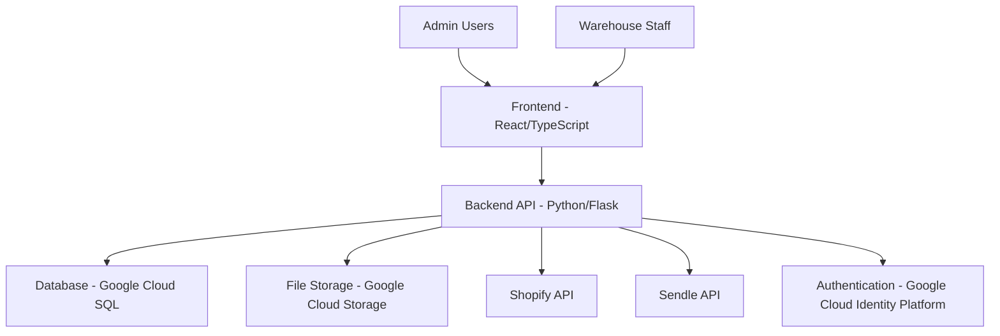

1. **Frontend Application**
   - Built with React and TypeScript
   - Styled using Tailwind CSS for responsive design
   - Optimized for desktop browsers in a warehouse environment

2. **Backend API**
   - Developed in Python using the Flask framework
   - RESTful API design for communication with the frontend
   - Handles business logic, data processing, and third-party API interactions

3. **Database**
   - Google Cloud SQL for PostgreSQL
   - Stores order data, inventory information, user data, and system configurations

4. **File Storage**
   - Google Cloud Storage for storing large files (e.g., shipping labels, reports)

5. **External API Integrations**
   - Shopify API for order management and inventory synchronization
   - Sendle API for shipping label generation and tracking information

6. **Authentication and Authorization**
   - Google Cloud Identity Platform for secure user authentication
   - Role-based access control (RBAC) for feature authorization

7. **Monitoring and Logging**
   - Google Cloud Monitoring for system performance tracking
   - Google Cloud Logging for centralized log management

### 1.1.2 Key Features

1. **Order Management**
   - Automatic retrieval of unfulfilled orders from Shopify
   - Categorization of orders based on fulfillment capability
   - Real-time order status updates

2. **Inventory Management**
   - Real-time inventory tracking and updates
   - Barcode scanning for inventory intake and verification
   - Synchronization of inventory levels with Shopify

3. **Order Fulfillment Process**
   - Guided fulfillment workflow with barcode scanning
   - Integration with Sendle API for shipping label generation
   - Automated updating of order status in Shopify

4. **Reporting and Analytics**
   - Generation of inventory level reports
   - Order fulfillment performance metrics
   - Export functionality for unfulfillable orders

5. **User Management**
   - Role-based access control for different user types (admin, warehouse staff)
   - Secure authentication using Google Cloud Identity Platform

### 1.1.3 Technology Stack

| Component | Technology |
|-----------|------------|
| Frontend Framework | React with TypeScript |
| UI Styling | Tailwind CSS |
| Backend Framework | Python Flask |
| Database | Google Cloud SQL (PostgreSQL) |
| File Storage | Google Cloud Storage |
| Authentication | Google Cloud Identity Platform |
| API Integrations | Shopify API, Sendle API |
| Monitoring & Logging | Google Cloud Monitoring, Google Cloud Logging |
| Deployment | Google Cloud Run |

This system overview provides a high-level understanding of the Inventory Management and Fulfillment Application's architecture, key features, and technology stack. The use of modern web technologies and Google Cloud solutions ensures a scalable, maintainable, and efficient application that meets the client's needs for streamlined order fulfillment and inventory management.

# 3. SYSTEM ARCHITECTURE

## 3.1 PROGRAMMING LANGUAGES

The Inventory Management and Fulfillment Application will utilize the following programming languages:

| Language | Purpose | Justification |
|----------|---------|---------------|
| TypeScript | Frontend development | Provides static typing for improved code quality and developer productivity. Enhances maintainability and scalability of the React application. |
| Python | Backend development | Offers excellent libraries for web development (Flask) and data processing. Aligns with the existing infrastructure and team expertise. |
| SQL | Database queries | Standard language for interacting with PostgreSQL database, ensuring efficient data retrieval and manipulation. |
| HTML5 | Markup language | Essential for structuring web content, working seamlessly with React for component-based architecture. |
| CSS3 (via Tailwind CSS) | Styling | Tailwind CSS provides a utility-first approach, enabling rapid UI development and consistent design across the application. |

## 3.2 HIGH-LEVEL ARCHITECTURE DIAGRAM

The following diagram provides an overview of the system's components and their interactions:

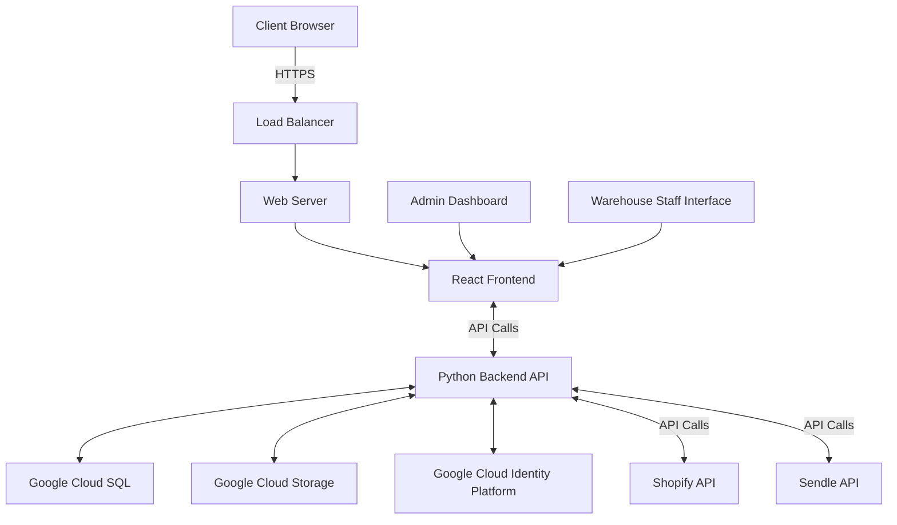

## 3.3 COMPONENT DIAGRAMS

### 3.3.1 Frontend Components

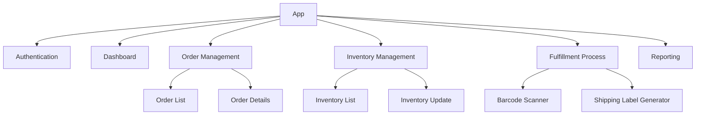

### 3.3.2 Backend Components

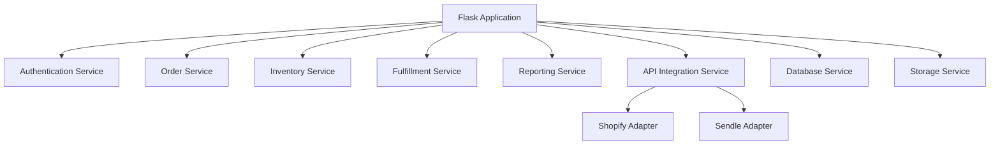

## 3.4 SEQUENCE DIAGRAMS

### 3.4.1 Order Fulfillment Process

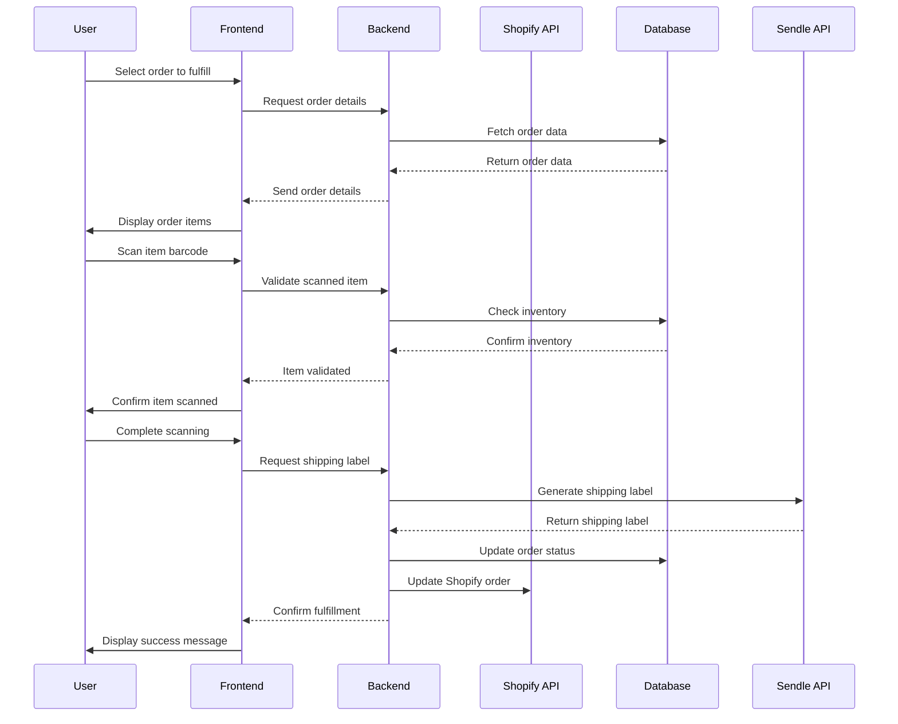

## 3.5 DATA-FLOW DIAGRAM

The following diagram illustrates how information moves through the Inventory Management and Fulfillment Application:

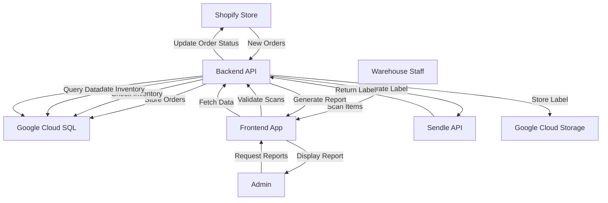

This data flow diagram demonstrates the movement of information from the Shopify store through the application's components, including user interactions, data storage, and external API integrations. It highlights the central role of the Backend API in coordinating data flow between various parts of the system, ensuring efficient order processing, inventory management, and reporting functionalities.

# 3. SYSTEM DESIGN

## 3.1 PROGRAMMING LANGUAGES

The Inventory Management and Fulfillment Application will utilize the following programming languages:

| Language | Purpose | Justification |
|----------|---------|---------------|
| TypeScript | Frontend development | Provides static typing for improved code quality and developer productivity. Enhances maintainability and scalability of the React application. |
| Python | Backend development | Offers excellent libraries for web development (Flask) and data processing. Aligns with the existing infrastructure and team expertise. |
| SQL | Database queries | Standard language for interacting with PostgreSQL database, ensuring efficient data retrieval and manipulation. |
| HTML5 | Markup language | Essential for structuring web content, working seamlessly with React for component-based architecture. |
| CSS3 (via Tailwind CSS) | Styling | Tailwind CSS provides a utility-first approach, enabling rapid UI development and consistent design across the application. |

## 3.2 DATABASE DESIGN

The application will use Google Cloud SQL for PostgreSQL as the primary database. The database schema is designed to support the core functionalities of inventory management and order fulfillment.

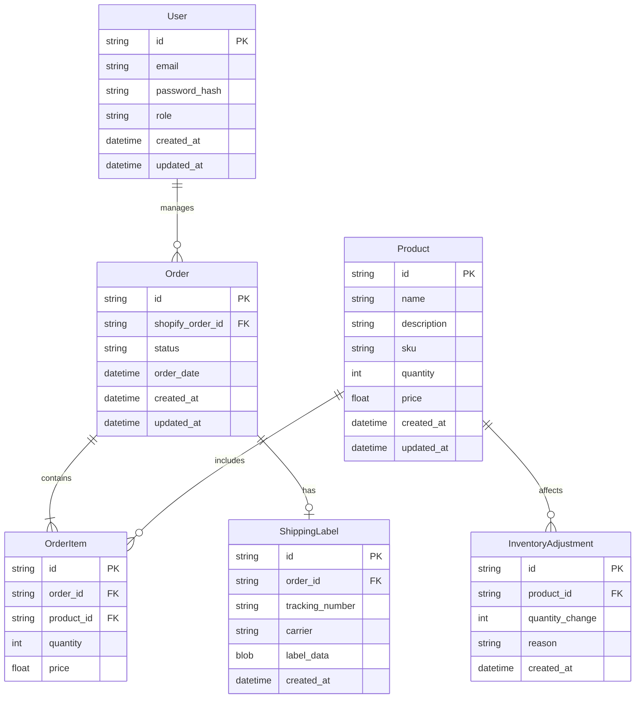

## 3.3 API DESIGN

The application will expose a RESTful API for communication between the frontend and backend, as well as for integration with external services.

### 3.3.1 Internal API Endpoints

| Endpoint | Method | Description |
|----------|--------|-------------|
| `/api/auth/login` | POST | User authentication |
| `/api/auth/logout` | POST | User logout |
| `/api/products` | GET, POST | Retrieve and create products |
| `/api/products/:id` | GET, PUT, DELETE | Manage individual products |
| `/api/orders` | GET, POST | Retrieve and create orders |
| `/api/orders/:id` | GET, PUT | Manage individual orders |
| `/api/orders/:id/fulfill` | POST | Fulfill an order |
| `/api/inventory/adjust` | POST | Adjust inventory levels |
| `/api/reports/inventory` | GET | Generate inventory reports |
| `/api/reports/fulfillment` | GET | Generate fulfillment reports |

### 3.3.2 External API Integrations

1. Shopify API
   - Purpose: Sync orders and inventory with Shopify store
   - Authentication: OAuth 2.0
   - Key endpoints:
     - `/admin/api/2023-04/orders.json` (GET, POST)
     - `/admin/api/2023-04/products.json` (GET, PUT)

2. Sendle API
   - Purpose: Generate shipping labels
   - Authentication: API Key
   - Key endpoints:
     - `/api/orders` (POST) - Create a shipping order
     - `/api/orders/:id/labels` (GET) - Retrieve shipping label

## 3.4 USER INTERFACE DESIGN

The user interface will be built using React with TypeScript and styled using Tailwind CSS. The design will focus on usability and efficiency for warehouse operations.

### 3.4.1 Main Components

1. Login Screen
2. Dashboard
3. Order Management
4. Inventory Management
5. Fulfillment Process
6. Reporting

### 3.4.2 Dashboard Layout

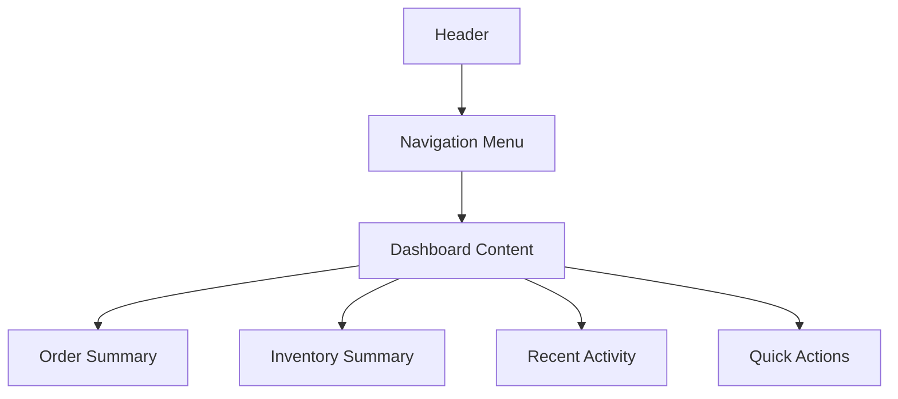

### 3.4.3 Order Fulfillment Process

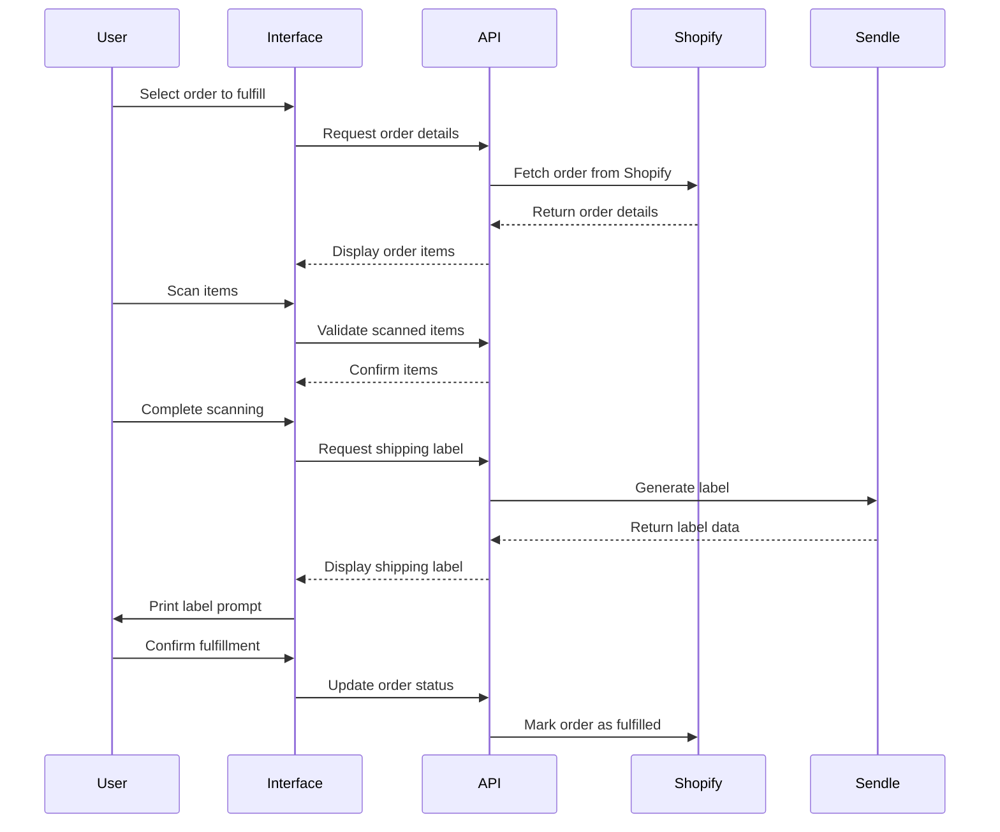

The user interface will be designed to be intuitive, responsive, and optimized for desktop use in a warehouse environment. Large, touch-friendly buttons and high-contrast design elements will be used to ensure usability while wearing gloves or in varying light conditions.

This system design leverages TypeScript and React for a robust frontend, Python for a scalable backend, and Google Cloud SQL for secure and efficient data storage. The API design facilitates seamless communication between system components and external services, while the user interface is optimized for warehouse operations.

# TECHNOLOGY STACK

## PROGRAMMING LANGUAGES

| Language | Purpose | Justification |
|----------|---------|---------------|
| TypeScript | Frontend development | Provides static typing for improved code quality and developer productivity. Enhances maintainability and scalability of the React application. |
| Python | Backend development | Offers excellent libraries for web development (Flask) and data processing. Aligns with the existing infrastructure and team expertise. |
| SQL | Database queries | Standard language for interacting with PostgreSQL database, ensuring efficient data retrieval and manipulation. |
| HTML5 | Markup language | Essential for structuring web content, working seamlessly with React for component-based architecture. |
| CSS3 (via Tailwind CSS) | Styling | Tailwind CSS provides a utility-first approach, enabling rapid UI development and consistent design across the application. |

## FRAMEWORKS AND LIBRARIES

### Frontend

| Framework/Library | Purpose |
|-------------------|---------|
| React | UI component library for building interactive user interfaces |
| React Router | Handling client-side routing in the single-page application |
| Redux | State management for complex application data flow |
| Axios | HTTP client for making API requests |
| React Query | Data fetching and caching library |
| React Testing Library | Testing utility for React components |
| ESLint | Static code analysis tool for identifying problematic patterns |
| Prettier | Code formatter for maintaining consistent code style |

### Backend

| Framework/Library | Purpose |
|-------------------|---------|
| Flask | Lightweight web framework for building the RESTful API |
| SQLAlchemy | ORM (Object-Relational Mapping) for database interactions |
| Flask-RESTful | Extension for building REST APIs with Flask |
| Marshmallow | Object serialization/deserialization library |
| Celery | Distributed task queue for handling background jobs |
| pytest | Testing framework for Python code |
| Black | Code formatter for Python |
| mypy | Static type checker for Python |

## DATABASES

| Database | Purpose |
|----------|---------|
| Google Cloud SQL (PostgreSQL) | Primary relational database for storing application data |
| Redis | In-memory data structure store for caching and session management |

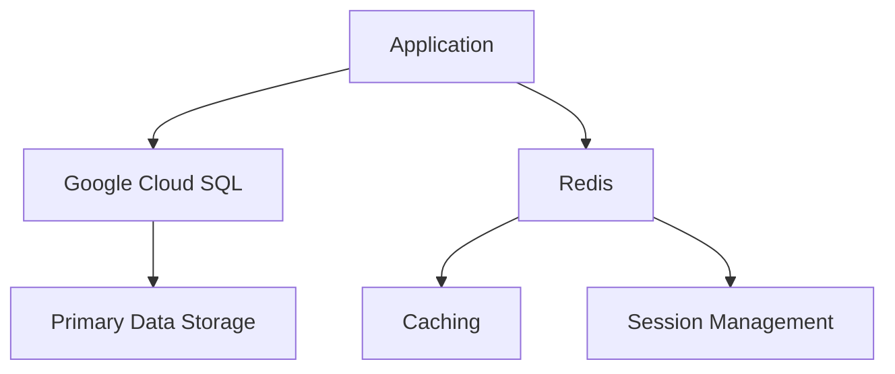

## THIRD-PARTY SERVICES

| Service | Purpose |
|---------|---------|
| Google Cloud Identity Platform | User authentication and authorization |
| Google Cloud Storage | File storage for shipping labels and reports |
| Google Cloud Logging | Centralized logging service |
| Google Cloud Monitoring | Application and infrastructure monitoring |
| Shopify API | Integration with e-commerce platform for order and product management |
| Sendle API | Shipping label generation and tracking information |
| Google Cloud Tasks | Managed service for distributed task execution |
| Google Cloud Pub/Sub | Messaging service for event-driven architecture |

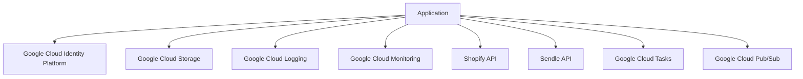

This technology stack leverages TypeScript and React for a robust frontend, Python for a scalable backend, and Google Cloud services for infrastructure and additional functionality. The combination of these technologies provides a modern, maintainable, and scalable solution for the Inventory Management and Fulfillment Application.

# SECURITY CONSIDERATIONS

## AUTHENTICATION AND AUTHORIZATION

The Inventory Management and Fulfillment Application will implement a robust authentication and authorization system using Google Cloud Identity Platform, ensuring secure access control and user management.

### Authentication

1. User Authentication Flow:

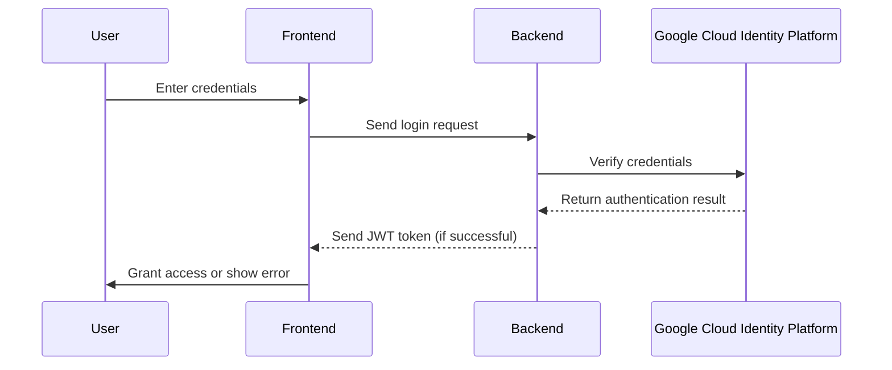

2. Multi-Factor Authentication (MFA):
   - Enable MFA for all user accounts, especially for admin and high-privilege users.
   - Support SMS-based and authenticator app-based MFA options.

3. Password Policy:
   - Enforce strong password requirements (minimum 12 characters, including uppercase, lowercase, numbers, and special characters).
   - Implement password history to prevent reuse of recent passwords.
   - Enforce password expiration every 90 days.

### Authorization

1. Role-Based Access Control (RBAC):

| Role | Permissions |
|------|-------------|
| Admin | Full access to all system features and configurations |
| Warehouse Manager | Manage inventory, view reports, process orders |
| Warehouse Staff | Process orders, update inventory |
| Readonly User | View orders and inventory without modification rights |

2. Implement least privilege principle:
   - Users are granted the minimum level of access required for their role.
   - Regularly review and audit user permissions.

3. API Authorization:
   - Use OAuth 2.0 for Shopify API integration.
   - Implement API key authentication for Sendle API.

## DATA SECURITY

1. Encryption:
   - Implement AES-256 encryption for data at rest in Google Cloud SQL.
   - Use TLS 1.3 for all data in transit.

2. Sensitive Data Handling:
   - Store sensitive data (e.g., API keys, passwords) in Google Cloud Secret Manager.
   - Mask sensitive information in logs and user interfaces.

3. Data Access Controls:
   - Implement row-level security in PostgreSQL for multi-tenant data isolation.
   - Use Google Cloud IAM for managing access to cloud resources.

4. Data Retention and Deletion:
   - Implement automated data retention policies in compliance with regulations.
   - Securely delete data using industry-standard methods when required.

5. Backup and Recovery:
   - Implement daily encrypted backups of all data stored in Google Cloud Storage.
   - Regularly test data recovery procedures.

## SECURITY PROTOCOLS

1. Network Security:
   - Implement Web Application Firewall (WAF) using Google Cloud Armor.
   - Use Virtual Private Cloud (VPC) for network isolation.
   - Enable HTTPS-only communication with valid SSL/TLS certificates.

2. Application Security:
   - Implement Content Security Policy (CSP) headers.
   - Use secure coding practices to prevent common vulnerabilities (e.g., XSS, CSRF, SQL Injection).
   - Regularly update all dependencies and libraries to their latest secure versions.

3. Monitoring and Logging:
   - Implement centralized logging using Google Cloud Logging.
   - Set up real-time security alerts for suspicious activities.
   - Use Google Cloud Security Command Center for threat detection and security analytics.

4. Incident Response Plan:
   - Develop and maintain an incident response plan.
   - Conduct regular security drills and tabletop exercises.

5. Compliance and Auditing:
   - Conduct regular security audits and penetration testing.
   - Maintain compliance with relevant standards (e.g., PCI DSS, GDPR).

6. API Security:
   - Implement rate limiting and throttling to prevent API abuse.
   - Use API keys with short expiration times and rotate them regularly.

7. Frontend Security:
   - Implement Cross-Origin Resource Sharing (CORS) policies.
   - Use React's built-in XSS protection and sanitize user inputs.

8. Backend Security:
   - Use parameterized queries to prevent SQL injection.
   - Implement proper error handling to avoid information leakage.

9. Security Training:
   - Provide regular security awareness training for all team members.
   - Conduct code reviews with a focus on security best practices.

10. Third-Party Security:
    - Regularly assess and audit third-party integrations (Shopify, Sendle).
    - Implement sandbox environments for testing integrations.

By implementing these security considerations, the Inventory Management and Fulfillment Application will maintain a robust security posture, protecting sensitive data and ensuring secure operations across all components of the system.